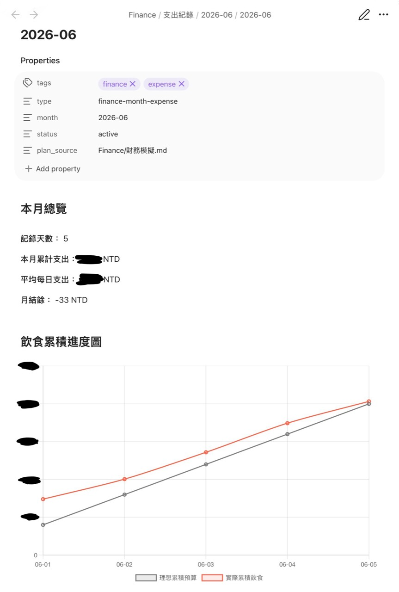
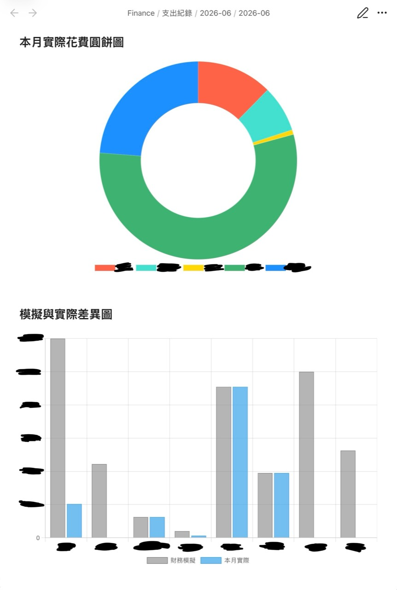

# Finance Ledger

這是一個用於 Obsidian 的 AI agent skill，可協助你記錄每日支出、追蹤預算，並自動整理每月財務統計。

English: [README.en.md](README.en.md)

## 功能

- 透過自然語言或口頭描述記錄每天的花費
- 依月份建立每日支出筆記，避免所有資料集中在同一個檔案
- 將每筆支出整理成結構化表格，供 Dataview 與圖表統計
- 新增或修改花費後，當月總覽、表格與圖表會同步更新
- 比較理想預算和實際支出，方便追蹤每日及每月的結餘
- 保留使用者既有的 Vault 結構、語言與分類習慣

## 範例

<table>
  <tr>
    <td width="50%">
      
    </td>
    <td width="50%">
      
    </td>
  </tr>
</table>

### 差異表

| 類別 | 模擬金額 | 實際金額 | 結餘 | 使用率 | 判讀 |
| --- | ---: | ---: | ---: | ---: | --- |
| 飲食 | 12,000 | 1,860 | +10,140 | 15.5% | 達標或有結餘 |
| 訂閱費 | 1,249 | 1,249 | +0 | 100.0% | 達標或有結餘 |
| 交通 | 400 | 172 | +228 | 43.0% | 達標或有結餘 |
| 投資 | 13,000 | 13,000 | +0 | 100.0% | 達標或有結餘 |
| 儲蓄 | 10,000 | 0 | +10,000 | 0.0% | 尚未投入 |
| 其他 | 5,255 | 430 | +4,825 | 8.2% | 達標或有結餘 |

### 月末檢討

- 本月總支出：16,711 NTD
- 與理想值差異：+25,193 NTD
- 超支最多的類別：無
- 下月要調整的地方：觀察飲食與交通的實際使用速度，必要時提高每日追蹤密度

### 每日紀錄

| 日期 | 飲食 | 交通 | 其他 | 今日差額 | 累積差額 |
| --- | ---: | ---: | ---: | ---: | ---: |
| 01-01 | 520 | 80 | 0 | -120 | -120 |
| 01-02 | 260 | 0 | 0 | +140 | +20 |
| 01-03 | 430 | 50 | 0 | -30 | -10 |
| 01-04 | 350 | 0 | 0 | +50 | +40 |
| 01-05 | 300 | 40 | 20 | +100 | +140 |

> 這些數字只是範例，用來展示表格與欄位格式，並不代表任何真實支出。

## 支出分類

你可以依自己的財務規劃建立分類，例如：

- 飲食
- 訂閱費
- 交通費
- 投資
- 儲蓄
- 其他

這些名稱只是範例。AI agent 應優先沿用使用者 Vault 內既有的分類與語言，也可以依需求新增或調整分類。

## 使用方式

使用者每天可以直接向 AI agent 描述當天花費，例如：

> 今天午餐花了 180 元，搭火車花了 63 元。

AI agent 會將內容整理到當日支出筆記，分別歸類為飲食與交通，並重新計算當日支出、預算差額及當月累積結果。

每個月都有一份彙整頁面。只要新增或修改每日花費，當月的統計表、分類圖表與預算比較就會同步更新，方便隨時追蹤每天及整月的開銷。

## 專案結構

- `SKILL.md`：AI agents 使用的主要技能說明
- `agents/openai.yaml`：skill 清單與介面所需的 metadata
- `references/finance-workflow.md`：完整的記帳工作流程與資料結構
- `assets/`：README 使用的範例圖片

## 注意事項

- 預設分類名稱使用英文，但實際寫入筆記時應配合使用者的語言及 Vault 現有內容。
- 詳細預算規則應以使用者 Vault 內的 `Finance/AGENTS.md` 或同類規則文件為準。
- 交通與其他非飲食支出可以獨立統計，不必從每日飲食預算扣除。
- 建議搭配 Typeless 這類語音鍵盤使用，口述輸入會更自然。
- 如果要在 Obsidian 跨裝置同步，建議使用 GitHub 作為同步來源。
- 手機端可搭配 GitSync App 進行跨裝置同步。
